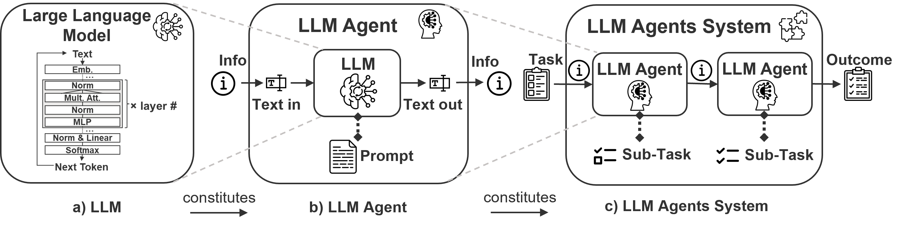

# AASbyLLM
Generating digital twins models with large language models.

## Live Prototype
A web-application is hosted here (prototype version): [https://aasbyllmappv16-yawjvp4zbq-ew.a.run.app](https://aasbyllmappv16-yawjvp4zbq-ew.a.run.app)

(Note: It may take 20 seconds to 2 minutes for the elastic server system to boot up. The server automatically shuts down after being idle for 10 minutes and clears all the data.)

# Demo: Generating AAS structured information model from PDF


A demo Video with higher resolution is availabe: [Demo VideoDemo_AAS_generation.mov](Demo_AAS_generation.mov)

# Source code realease
The folder **source_code** contains the simplified source code for reproducibility, taking into account the copyright restrictions of external libraries used in the RAG mechanism. These libraries have been excluded without significantly affecting functionality.

# The Research Paper
Details of this work has been documented in a journal paper, we paid the Open-Access-Fee to the publisher to make it open-source:

The Paper: [Generation of Asset Administration Shell with Large Language Model Agents: Towards Semantic Interoperability in Digital Twins in the Context of Industry 4.0](https://www.doi.org/10.1109/ACCESS.2024.3415470)

>📄 [Y. Xia](https://yuchenxia.github.io/), Z. Xiao, N. Jazdi and M. Weyrich, "Generation of Asset Administration Shell with Large Language Model Agents: Towards Semantic Interoperability in Digital Twins in the Context of Industry 4.0," in IEEE Access, doi: 10.1109/ACCESS.2024.3415470.

```bibtex
@ARTICLE{10559483,
  author={Xia, Yuchen and Xiao, Zhewen and Jazdi, Nasser and Weyrich, Michael},
  journal={IEEE Access}, 
  title={Generation of Asset Administration Shell with Large Language Model Agents: Towards Semantic Interoperability in Digital Twins in the Context of Industry 4.0}, 
  year={2024},
  keywords={Semantics;Data models;Digital twins;Context modeling;Interoperability;Unified modeling language;Fourth Industrial Revolution;Asset Administration Shell;Large Language Model;Semantic Interoperability;Digital Twin;Industry 4.0;Generative AI;Retrieval-Augmented Generation},
  doi={10.1109/ACCESS.2024.3415470}}
```

### Abstract
This research introduces a novel approach for achieving semantic interoperability in digital twins and assisting the creation of Asset Administration Shell (AAS) as digital twin model within the context of Industry 4.0. The foundational idea of our research is that the communication based on semantics and the generation of meaningful textual data are directly linked, and we posit that these processes are equivalent if the exchanged information can be serialized in text form. Based on this, we construct a “semantic node” data structure in our research to capture the semantic essence of textual data. Then, a system powered by large language models is designed and implemented to process the “semantic node” and generate standardized digital twin models (AAS instance models in the context of Industry 4.0) from raw textual data collected from datasheets describing technical assets. Our evaluation demonstrates an effective generation rate of 62-79%, indicating a substantial proportion of the information from the source text can be translated error-free to the target digital twin instance model with the generative capability of large language models. This result has a direct application in the context of Industry 4.0, and the designed system is implemented as a data model generation tool for reducing the manual effort in creating AAS model by automatically translating unstructured textual data into a standardized AAS model. The generated AAS model can be integrated into AAS-compliant digital twin software for seamless information exchange and communication. In our evaluation, a comparative analysis of different LLMs and an in-depth ablation study of Retrieval-Augmented Generation (RAG) mechanisms provide insights into the effectiveness of LLM systems for interpreting technical concepts and translating data. Our findings emphasize LLMs’ capability to automate AAS instance creation and contribute to the broader field of semantic interoperability for digital twins in industrial applications.


### Graphical abstract:


### LLM-Agent design:


# The Main Features of 'AASbyLLM' and Its Novel Contributions:
### Technologies:
- First research prototype applying **generative LLM** for generating AAS
- Apply generative LLMs for **inferencing** and embedding LLMs for **similarity retrieval**

### Benefits:
- Wider range of **input flexibility** and format independent, as long as the meaning of text input is understandable
- **Generally applicable** to different disciplinary domains.
- Instead of using manually crafted mapping rules, the system utilizes the knowledge learned by LLMs
- The system adds proper **semantic annotation** for disambiguating the **concepts of the data property**
- The system optimizes relevant information details during the processing and enhances the quality of AAS 

### Implications:
- This prototype demonstrates the machine capability to **semantically understand and generate data properties for industrial applications**.
- This capability can enable:
  1. an **interoperable** information exchange in the context of **digitalization**
  2. and higher degree of **task automation** in the context of **autonomization**

# Details about the prompts for the LLM agents

### The prompts have the following structure


### Extraction agent prompt
The prompt for extraction agent: [extraction_agent_prompt](extraction_agent_prompt.txt)

The extraction LLM agent is designed to identify and extract the name, the value, and an initial definition for a semantic node from the input text. This LLM processes the given input text and initially creates a name, definition, and contextual description for each semantic node as output, enriching the raw data with semantic details in a data structure.

### Semantic search agent
This agent does not require a prompt. Following identification and extraction, this agent performs a semantic search using an embedding LLM to find semantically similar entries in the ECLASS dictionary. The search mechanism is based on our [previous work](https://ieeexplore.ieee.org/document/9921637)📄:
>📄 Y. Xia, N. Jazdi and M. Weyrich, "Automated generation of Asset Administration Shell: a transfer learning approach with neural language model and semantic fingerprints," 2022 IEEE 27th International Conference on Emerging Technologies and Factory Automation (ETFA), Stuttgart, Germany, 2022, pp. 1-4, doi: 10.1109/ETFA52439.2022.9921637.

where a vectorized embedding index, called “semantic fingerprint”, is created for comparison between queried text and each ECLASS dictionary entry. The result is a list of retrieved similar definition entries from ECLASS dictionary.


### Synthesis agent prompt
The prompt for extraction agent: [synthesis_agent_prompt](synthesis_agent_prompt.txt)

This step incorporates the results from the semantic search into the generation process. An LLM-agent is prompted to generate a judgment of the relevance of the retrieved entries, accompanied by a short reason in text. The purpose of this step is two folds: firstly, semantic search is based on relationship of semantic similarity, which is a typical proxy metric for search but suboptimal for determining precise relevance. Inappropriate results shall be filtered out; Secondly, in this step, the generated judgement and reason serve as intermediate textual material for considering more nuanced relationships during the whole process. By instructing the LLM to judge and reason for each search result, the LLM generates more precise semantic node. After synthesis, a complete semantic node is created based on RAG, ready for AAS model creation.

<a href="https://yuchenxia.github.io/" target="_blank">Yuchen Xia</a> is a PhD candidate specializing in LLM agents, digital twins, and industrial automation since 2021. You can find more about his work and projects on his <a href="https://yuchenxia.github.io/" target="_blank">personal website</a>.
